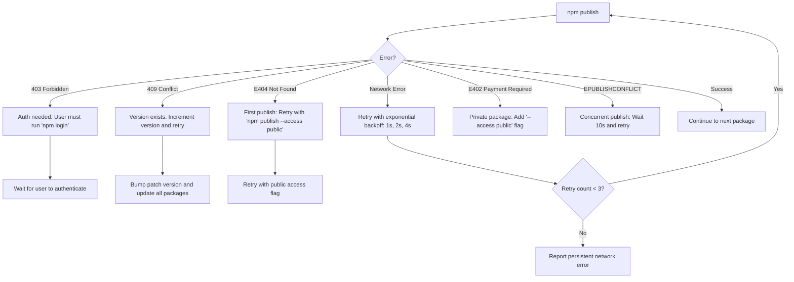

# Shelltender Release Guide for Claude

This guide provides exact instructions for Claude to execute release procedures autonomously. Every decision point has explicit criteria.

## Pre-Flight Release Summary

Before starting, Claude should output:
- Current version: X.Y.Z  
- Proposed new version: X.Y.Z (with reasoning)
- Branch: main/dev/etc
- Key changes being released (bullet points)
- Estimated time: ~10-15 minutes
- Any known issues that might affect the release

## Pre-Release Environment Check

Before starting any release, Claude should verify:

```bash
# Check all prerequisites in parallel
pwd  # Should show the shelltender project root
git branch --show-current  # Should be main/master or release branch
git status --short  # Should be empty (no uncommitted changes)
git fetch origin  # Update remote tracking
git status -uno  # Check if local is up to date with remote
ls -la packages/  # Should show core, server, client, shelltender directories
```

**Environment Checklist:**
- [ ] Current working directory is project root
- [ ] Git is on main/master branch (or explicitly note if not)
- [ ] No uncommitted changes exist
- [ ] All local branches are up to date with remote
- [ ] All required packages directories exist

If any check fails, resolve before proceeding.

## State Recovery for Interrupted Releases

If a release is interrupted, Claude should first check:
```bash
# Quick state check
echo "=== RELEASE STATE CHECK ==="
echo "Last commit: $(git log -1 --oneline)"
echo "Current version: $(grep '"version"' packages/core/package.json)"
echo "NPM published: $(npm view @shelltender/core version)"
echo "Last tag: $(git describe --tags --abbrev=0)"
echo "Uncommitted changes: $(git status --porcelain | wc -l)"
```

Then determine where to resume based on:
- If version in package.json > npm → Resume at Step 8 (npm publish)
- If tag exists but not pushed → Resume at Step 7 (push tag)
- If changes uncommitted → Resume at Step 6 (commit)

## Current Release Status

As of the last update to this guide:
- Current version: 0.5.0
- Last release introduced single port mode as default and fixed WebSocket connection race condition
- All packages are synchronized at the same version
- The CHANGELOG.md has the v0.5.0 release documented

To check if a release has already been created:
```bash
git tag -l "v*" | tail -5  # Show last 5 version tags
```

## Common Release Scenarios

### Hotfix Release (like v0.4.3)
- Usually just a PATCH bump
- Minimal changes (1-2 commits)
- Can be released from dev branch
- Typical time: 5-10 minutes

### Feature Release
- Usually MINOR bump
- Multiple features/fixes
- Should be from main branch
- Typical time: 10-15 minutes

### Major Release
- MAJOR bump (breaking changes)
- Requires extra user confirmation
- Must list all breaking changes
- Typical time: 15-20 minutes

## Claude Tool Usage Pattern

Execute this release using these specific tool patterns:

1. **Start with TodoWrite** - Create these 11 release steps IMMEDIATELY:
   ```
   - Step 1: Check current version and branch
   - Step 2: Run pre-release checks
   - Step 3: Update version numbers
   - Step 4: Update CHANGELOG
   - Step 5: Rebuild and test
   - Step 6: Commit version changes
   - Step 7: Create and push tag
   - Step 8: Publish to npm
   - Step 9: Create GitHub release
   - Step 10: Verify release
   - Step 11: Update release guide
   ```

   **Todo List Best Practices:**
   - Create the 11-step todo list immediately upon starting
   - Update status to "in_progress" BEFORE starting each step
   - Mark "completed" immediately after finishing
   - If a step fails, add a new todo for the fix before proceeding
   - Never batch todo updates - update immediately after each state change

2. **Use MultiEdit** for simultaneous updates:
   - Update all 4 package.json files in ONE operation
   - Never edit package.json files individually
   - Read all files first, then use separate MultiEdit calls if needed

3. **Use Bash tool** with exact commands:
   - Copy commands exactly as shown
   - Never use interactive flags (-i, --interactive)
   - Always check command success before proceeding

4. **Parallel Operations** - Run these in parallel for efficiency:
   ```bash
   # All npm dry-run commands
   # All npm view commands for verification  
   # Reading multiple package.json files
   # Git status checks across different aspects
   ```

5. **State tracking** - Initialize and maintain throughout:
   ```typescript
   // Claude: Initialize these at the start
   const releaseState = {
     // Version Management
     PREVIOUS_VERSION: "",     // Set from: grep '"version"' packages/core/package.json
     CURRENT_VERSION: "",      // Same as PREVIOUS_VERSION initially
     NEW_VERSION: "",          // Calculate based on RELEASE_TYPE
     BRANCH_NAME: "",          // Set from: git branch --show-current
     RELEASE_TYPE: "",         // PATCH|MINOR|MAJOR - determined from commits
     
     // Progress Tracking
     STEPS_COMPLETED: [],      // Track: ["step1", "step2", ...]
     ERRORS_ENCOUNTERED: [],   // Log all errors with step number
     NPM_PUBLISH_STATUS: {     // Track per-package publish status
       "@shelltender/core": "pending",
       "@shelltender/server": "pending",
       "@shelltender/client": "pending",
       "shelltender": "pending"
     },
     
     // Test & Build Results
     TEST_STATUS: "not_run",   // not_run|passed|failed|failed_non_critical
     TEST_RESULTS: {
       passed: false,
       failures: 0,
       criticalFailures: [],
       nonCriticalFailures: []
     },
     BUILD_METRICS: {
       time: 0,              // Build time in seconds
       bundleSize: 0,        // Largest bundle in MB
       warnings: []
     }
   };
   
   // Claude should maintain these variables throughout the release
   // Update TodoWrite with current state after each step
   ```

## Optimized Parallel Operations

Claude should run these groups in parallel:

### Group 1 - Initial Checks:
```bash
pwd
git branch --show-current
git status --short
git fetch origin
git status -uno
ls -la packages/
```

### Group 2 - Version Verification:
```bash
grep '"version"' packages/core/package.json
git tag -l "v*" | tail -5
git log $(git describe --tags --abbrev=0)..HEAD --oneline
```

### Group 3 - NPM Checks:
```bash
npm view @shelltender/core version
npm view @shelltender/server version
npm view @shelltender/client version
npm view shelltender version
```

## Claude Must NEVER

These are absolute prohibitions with no exceptions:

1. **NEVER force push without explicit user confirmation**
   - Even if suggested, always ask: "This requires force push. Are you absolutely sure?"

2. **NEVER skip the dry run for npm publish**
   - Always run `--dry-run` first, no matter what

3. **NEVER delete git tags without user confirmation**
   - Deleting tags is destructive and irreversible

4. **NEVER proceed with MAJOR version bump without listing breaking changes**
   - Always show: "This is a MAJOR version bump. Breaking changes detected: [list]"

5. **NEVER use sudo or elevated permissions**
   - If permission denied, ask user to fix permissions

6. **NEVER modify git configuration**
   - No `git config` commands, ever

7. **NEVER publish to npm if tests are failing**
   - Even if user says to proceed, remind them of the failing tests

8. **NEVER commit with --no-verify**
   - Pre-commit hooks exist for a reason

## Branch Strategy

Before proceeding with a release, ensure you're on the appropriate branch:

```bash
# Check current branch
git branch --show-current

# Check if you have uncommitted changes
git status
```

**Branch Requirements:**
- **Preferred**: Releases should be made from `main` or `master` branch
- **Acceptable**: Release branches like `release/v0.2.4`
- **Not Recommended**: Feature branches (unless merging to main first)

If you're on a feature branch:
```bash
# Option 1: Merge to main first (recommended)
git checkout main
git pull origin main
git merge feature/your-branch

# Option 2: Create release from feature branch (document in release notes)
# Proceed with caution and note this in the GitHub release description
```

## Step 1: Determine Version Number

First, check what changes are pending release:
```bash
# Check for uncommitted changes
git status

# View recent commits since last tag
git log $(git describe --tags --abbrev=0)..HEAD --oneline

# Check current version in package.json
grep '"version"' packages/core/package.json

# Check what's published on npm
npm view @shelltender/core versions --json | tail -5
npm view @shelltender/server versions --json | tail -5
npm view @shelltender/client versions --json | tail -5
npm view shelltender versions --json | tail -5
```

### Handling Version Mismatches

If git tags and package.json versions don't match:

1. **Check npm registry** - What's actually published?
   ```bash
   npm view @shelltender/core version  # Latest published version
   ```

2. **Decision tree**:
   - If package.json > npm version → Previous release may have failed
   - If package.json = npm version → You're up to date
   - If git tag > package.json → Package.json wasn't updated in last release

3. **Resolution**:
   - Use package.json as source of truth if npm versions match
   - If versions were skipped, document in CHANGELOG
   - Always increment from the highest version found

Analyze recent changes to determine the version bump:

## Version Bump Decision Matrix

| Commit Pattern | Contains | Version Bump | Example |
|----------------|----------|--------------|----------|
| `feat:` | New features | MINOR | feat: add session persistence |
| `fix:` | Bug fixes only | PATCH | fix: resolve connection timeout |
| `BREAKING:` or `!:` | Breaking changes | MAJOR | feat!: change API response format |
| `chore:`, `docs:`, `test:` | No functional changes | PATCH | docs: update README |
| `refactor:` | Code improvements | PATCH | refactor: optimize buffer handling |
| `perf:` | Performance improvements | PATCH | perf: reduce memory usage |
| Multiple types | Mixed changes | Use highest | feat + fix = MINOR |
| No conventional commits | Any changes | PATCH | General updates |

**Note:** User override always takes precedence over automatic determination.

**Claude Version Determination Logic:**
```javascript
const determineVersionBump = (commits) => {
  // Check for breaking changes first (highest priority)
  if (commits.some(c => c.includes('BREAKING') || c.includes('!:'))) {
    return 'MAJOR';
  }
  // Check for new features
  if (commits.some(c => c.match(/^feat(\(.+\))?:/))) {
    return 'MINOR';
  }
  // Everything else is PATCH
  return 'PATCH';
};
```

## Step 2: Run Pre-release Checks

```bash
# 1. Ensure clean working directory
git status

# 2. Run all tests
npm test

# 3. Build all packages
npm run build
```

### Evaluating Test Failures

If tests fail, evaluate their severity:

**🛑 Critical Failures (STOP RELEASE):**
- Unit test failures in business logic
- Integration test failures
- Build errors or TypeScript compilation errors
- Security-related test failures
- Data corruption or loss scenarios
- Package export test failures affecting runtime
- Core functionality test failures (SessionManager, BufferManager, WebSocket)
- Any test failure containing "WebSocketService"
- Core functionality tests in server package
- Build failures in main packages (not demo)

**⚠️ Non-Critical Failures (PROCEED WITH CAUTION):**
- React `act()` warnings in tests
- CSS class name changes in snapshot tests
- Deprecation warnings
- Linting warnings (not errors)
- Minor styling test failures
- Mobile/Touch test failures (generally non-critical)
- SessionManager UI test failures (non-critical if only display-related)
- `SessionTabs.test.tsx` - CSS class mismatches
- `SessionManager.test.tsx` - Display-only failures (e.g., "Unable to find element")
- `exports.test.ts` - Package configuration tests
- Any test with "act()" warnings
- Demo app TypeScript errors (apps/demo)

## Known Test Failure Patterns

Add these specific patterns that Claude has encountered:

### Always Non-Critical:
- `SessionTabs.test.tsx` - CSS class mismatches
- `SessionManager.test.tsx` - Display-only failures (e.g., "Unable to find element")
- `exports.test.ts` - Package configuration tests
- Any test with "act()" warnings
- Demo app TypeScript errors (apps/demo)

### Always Critical:
- Any test failure containing "WebSocketService"
- Core functionality tests in server package
- Build failures in main packages (not demo)

## Common Issues and Recovery

### File Not Found Errors
If Claude encounters "file has not been read yet" errors:
1. Always use Read tool before Edit/MultiEdit
2. For batch updates, read all files first, then use separate MultiEdit calls
3. Never assume a file's content - always read first

### Test Failure Recovery
When tests fail:
1. Run tests with verbose output: `npm test -- --reporter=verbose`
2. Identify specific failing test files
3. Check if failures match known non-critical patterns
4. If unclear, share the specific failure with user for assessment

**Claude Test Failure Decision Logic:**
```javascript
// Exact logic for Claude to follow
const analyzeTestFailures = (output) => {
  const failures = output.match(/FAIL.*\.test\.(ts|tsx)/g) || [];
  
  for (const failure of failures) {
    // Critical patterns - MUST STOP
    if (failure.includes('SessionManager') || 
        failure.includes('BufferManager') ||
        failure.includes('integration') ||
        failure.includes('WebSocket')) {
      return {
        action: 'STOP',
        message: `Critical test failure detected: ${failure}. Core functionality is broken.`
      };
    }
  }
  
  // Non-critical patterns - can proceed
  const nonCritical = failures.filter(f => 
    f.includes('act()') || 
    f.includes('.css') || 
    f.includes('snapshot')
  );
  
  if (nonCritical.length === failures.length) {
    return {
      action: 'PROCEED',
      message: `Only UI/styling test failures (${failures.length} total). These are non-critical.`
    };
  }
  
  // Unknown failures - ask user
  return {
    action: 'ASK',
    message: `Found ${failures.length} test failures: ${failures.join(', ')}. These don't match known patterns. Should I proceed?`
  };
};
```

### Handling Build Warnings

**Claude Decision Matrix:**

| Warning Type | Action |
|-------------|--------|
| Chunk size < 1MB | ✅ Proceed |
| Chunk size 1-2MB | ⚠️ Proceed but note in release: "Large bundle size (XMB)" |
| Chunk size > 2MB | 🛑 Stop - Ask user: "Bundle size is XMB. This exceeds the 2MB threshold. Should I proceed?" |
| Peer dependency warnings | ✅ Proceed if package.json documents them |
| Source map warnings | ✅ Proceed |
| Security vulnerability (any) | 🛑 Stop - Report exact vulnerability |
| License compatibility | 🛑 Stop - Report exact license conflict |
| Missing dependencies | 🛑 Stop - Cannot proceed without deps |

## Quick Recovery Commands

For common issues Claude encounters:

### NPM 409 Error (Version Already Exists)
```bash
# Quick fix - bump patch version
CURRENT=$(grep '"version"' packages/core/package.json | cut -d'"' -f4)
NEW=$(echo $CURRENT | awk -F. '{print $1"."$2"."$3+1}')
echo "Bumping from $CURRENT to $NEW"
# Then re-run Step 3
```

### Build Failures in Demo App
```bash
# If only demo app fails, continue with:
npm run build --workspaces --if-present -- --ignore-scripts
```

## Step 3: Update Version Numbers

Use MultiEdit to update all package.json files simultaneously. Replace X.Y.Z with the new version:

```typescript
// Update these files:
// - /packages/core/package.json
// - /packages/server/package.json  
// - /packages/client/package.json
// - /packages/shelltender/package.json

// For each file, update:
// 1. The "version" field
// 2. Any @shelltender/* dependencies to match
```

Example for updating to 0.2.4:
- Change `"version": "0.2.3"` to `"version": "0.2.4"`
- Change `"@shelltender/core": "^0.2.3"` to `"@shelltender/core": "^0.2.4"`

## Step 4: Update CHANGELOG.md

Add a new section after `## [Unreleased]` with the format:

```markdown
## [X.Y.Z] - YYYY-MM-DD

### Fixed
- Description of fixes

### Added
- New features or files

### Changed
- Modified behavior
```

## Step 5: Rebuild and Test

```bash
# Rebuild with new versions
npm run build

# Run tests again to ensure everything works
npm test
```

## Step 6: Commit Version Changes

```bash
# Stage all changes
git add -A

# Commit with standardized message
git commit -m "chore: release vX.Y.Z

- Update all packages to vX.Y.Z
- Update CHANGELOG.md

🤖 Generated with Claude Code

Co-Authored-By: Claude <noreply@anthropic.com>"
```

## Step 7: Create and Push Git Tag

```bash
# Create annotated tag (replace X.Y.Z and description)
git tag -a vX.Y.Z -m "Release vX.Y.Z: Brief description"

# Push commits and tag to remote
git push origin HEAD
git push origin vX.Y.Z
```

## Step 8: Publish to npm Registry

**IMPORTANT**: Only proceed if the user has confirmed they want to publish to npm.

```bash
# Check npm login status
npm whoami

# If not logged in, the user will need to run:
# npm login

# Dry run first to verify package contents
npm publish --dry-run -w @shelltender/core
npm publish --dry-run -w @shelltender/server
npm publish --dry-run -w @shelltender/client
npm publish --dry-run -w shelltender

# If dry runs look good, publish for real with error tracking
PUBLISHED=()
FAILED=()

# Publish each package and track results
for pkg in "@shelltender/core" "@shelltender/server" "@shelltender/client" "shelltender"; do
  echo "Publishing $pkg..."
  if npm publish -w "$pkg" 2>&1; then
    PUBLISHED+=("$pkg")
  else
    FAILED+=("$pkg")
  fi
done

# Report results
if [ ${#FAILED[@]} -gt 0 ]; then
  echo "⚠️ PARTIAL PUBLISH - Action required!"
  echo "✅ Published: ${PUBLISHED[*]}"
  echo "❌ Failed: ${FAILED[*]}"
  echo "Run 'npm view [package] version' to verify state before retrying"
  echo "To retry failed packages only: npm publish -w [package-name]"
fi
```

## NPM Publish Decision Tree



**Claude NPM Error Handling:**
```javascript
const handleNpmError = (error, packageName, retryCount = 0) => {
  if (error.includes("403")) {
    return {
      action: "STOP",
      message: "Authentication required. Please run 'npm login' and let me know when ready."
    };
  }
  
  if (error.includes("409") || error.includes("EPUBLISHCONFLICT")) {
    return {
      action: "ASK_USER",
      message: `Version already exists for ${packageName}. Should I increment to next patch version?`
    };
  }
  
  if (error.includes("E404") || error.includes("E402")) {
    return {
      action: "RETRY",
      command: `npm publish -w "${packageName}" --access public`
    };
  }
  
  if (error.includes("network") && retryCount < 3) {
    return {
      action: "RETRY_WITH_BACKOFF",
      delay: Math.pow(2, retryCount) * 1000,
      message: `Network error, retrying in ${Math.pow(2, retryCount)}s...`
    };
  }
  
  return {
    action: "STOP",
    message: `Unknown error for ${packageName}: ${error}`
  };
};
```

## Multi-Package Coordination

### Package Publishing Order
Always publish in this exact order to respect dependencies:

1. **@shelltender/core** (no dependencies)
   - Base types and interfaces
   - Must succeed before continuing

2. **@shelltender/server** (depends on core)
   - Requires @shelltender/core to be published
   - Uses `^X.Y.Z` version of core

3. **@shelltender/client** (depends on core)
   - Requires @shelltender/core to be published
   - Uses `^X.Y.Z` version of core

4. **shelltender** (depends on all)
   - Requires all three packages published
   - Re-exports from all packages

If any package fails to publish:
- **STOP** immediately
- Assess the error using the decision tree
- Do NOT continue to dependent packages
- Report exact status to user

### Dependency Version Sync
When updating versions, ensure:
```json
// @shelltender/server/package.json
{
  "version": "X.Y.Z",
  "dependencies": {
    "@shelltender/core": "^X.Y.Z"  // Must match
  }
}

// shelltender/package.json  
{
  "version": "X.Y.Z",
  "dependencies": {
    "@shelltender/core": "^X.Y.Z",   // All must
    "@shelltender/server": "^X.Y.Z", // match the
    "@shelltender/client": "^X.Y.Z"  // new version
  }
}
```

## Step 9: Create GitHub Release

Execute these GitHub CLI commands:

```bash
# First, prepare the release notes (more robust extraction)
VERSION="X.Y.Z"  # Replace with actual version

# Extract release notes using awk (more reliable than sed)
awk -v ver="$VERSION" '
  /^## \['ver'\]/ {flag=1; next}
  /^## \[/ && flag {exit}
  flag {print}
' CHANGELOG.md > release_notes.md

# Review the extracted notes
cat release_notes.md

# Create the release (with fallback for title extraction)
TITLE=$(head -n1 release_notes.md | sed 's/^### //' || echo "Release updates")
gh release create "v$VERSION" \
  --title "v$VERSION - $TITLE" \
  --notes-file release_notes.md

# Clean up
rm release_notes.md
```

## GitHub Release Notes Template

For consistency, use this structure:

### For Hotfixes:
```
### Fixed
- [Primary fix description]
  - [Technical detail 1]
  - [Technical detail 2]

This hotfix ensures [user-facing benefit].
```

### For Feature Releases:
```
### Added
- [Feature 1]
- [Feature 2]

### Fixed
- [Fix 1]
- [Fix 2]

### Changed
- [Change 1]

See CHANGELOG.md for full details.
```

**Alternative: Manual release notes**
```bash
# If automatic extraction fails, create manually
gh release create vX.Y.Z \
  --title "vX.Y.Z - Brief Description" \
  --notes "### Fixed
- List fixes here

### Added  
- List additions here

See CHANGELOG.md for full details."
```

## Step 10: Post-release Verification

```bash
# Verify packages are published
npm view @shelltender/core version
npm view @shelltender/server version
npm view @shelltender/client version
npm view shelltender version

# Test the minimal integration example
cd packages/server
npx tsx examples/minimal-integration.ts
```

## Success Checkpoints

Claude should look for these indicators at each step:

- Step 1: ✓ Version numbers match across package.json files
- Step 2: ✓ Main packages build (ignore demo app)
- Step 3: ✓ All 4 package.json files updated
- Step 4: ✓ CHANGELOG has new version section
- Step 5: ✓ Build completes for core/server/client/shelltender
- Step 6: ✓ Git commit shows 5 files changed
- Step 7: ✓ Both pushes succeed (commits and tag)
- Step 8: ✓ All 4 packages show in npm registry
- Step 9: ✓ GitHub release URL returned
- Step 10: ✓ All verifications return new version
- Step 11: ✓ RELEASE_GUIDE.md updated

## Step 11: Post-Release Checklist

Complete these final tasks after the release:

```bash
# Claude: Execute these verification commands
npm view @shelltender/core version     # Should show X.Y.Z
npm view @shelltender/server version   # Should show X.Y.Z
npm view @shelltender/client version   # Should show X.Y.Z
npm view shelltender version           # Should show X.Y.Z

gh release view vX.Y.Z                 # Should show release details
git tag -l | grep vX.Y.Z              # Should show the tag
```

**Claude-Executable Checklist:**
```typescript
// Use this exact check sequence
const postReleaseChecks = {
  npmPackages: {
    command: "npm view @shelltender/core version",
    expected: NEW_VERSION,
    action: "✅ Confirmed" || "❌ Failed - version mismatch"
  },
  githubRelease: {
    command: "gh release view v" + NEW_VERSION,
    expected: "shows release",
    action: "✅ Confirmed" || "❌ Failed - release not found"
  },
  gitTag: {
    command: "git tag -l | grep v" + NEW_VERSION,
    expected: "v" + NEW_VERSION,
    action: "✅ Confirmed" || "❌ Failed - tag not found"
  },
  guideUpdate: {
    task: "Update RELEASE_GUIDE.md Current Release Status to " + NEW_VERSION,
    action: "Use MultiEdit tool"
  }
};
```

## Release Completion Summary

Claude should always end with:

🎉 **Release vX.Y.Z completed successfully!**

✅ All steps completed:
- Version updated to X.Y.Z in all packages
- CHANGELOG.md updated with release notes
- Code committed and tagged as vX.Y.Z
- All packages published to npm
- GitHub release created at [URL]
- Release guide updated

**Published packages:**
- @shelltender/core@X.Y.Z
- @shelltender/server@X.Y.Z
- @shelltender/client@X.Y.Z
- shelltender@X.Y.Z

[One-line summary of what this release does]

Users can now update with: `npm update shelltender`

**Human-Only Tasks (Claude: Skip these):**
- ~~Notify teams/users~~
- ~~Monitor CI/CD~~
- ~~Social media announcements~~

**Optional: Create announcement**
```markdown
# Shelltender vX.Y.Z Released! 🎉

Key changes:
- [Summary of major fixes/features]

Update with: `npm update shelltender`

Full changelog: [link to release]
```

## Quick Troubleshooting Tree

If something fails:
1. Is it a test failure? → Check if it's in the non-critical list
2. Is it a build failure? → Check if it's just the demo app
3. Is it an npm error? → Check the specific error code (403/409/etc)
4. Is it a git error? → Check branch and permissions
5. Is it a network error? → Retry with exponential backoff

## Rollback Procedures

If release fails after various stages, follow these recovery steps:

### 1. Git Tag Created but Not Pushed
```bash
# Delete local tag
git tag -d vX.Y.Z
```

### 2. Git Tag Pushed but npm Publish Failed
```bash
# Delete local tag
git tag -d vX.Y.Z

# Delete remote tag (requires user confirmation)
echo "This will delete the remote tag. Are you sure? (User must confirm)"
git push origin :refs/tags/vX.Y.Z
```

### 3. Partial npm Publish (Some Packages Failed)
```bash
# Check which packages were published
for pkg in "@shelltender/core" "@shelltender/server" "@shelltender/client" "shelltender"; do
  echo -n "$pkg: "
  npm view $pkg version 2>/dev/null || echo "NOT PUBLISHED"
done

# Document the state for user
echo "Partial publish detected. Successfully published packages cannot be rolled back."
echo "Options:"
echo "1. Fix issues and publish remaining packages with same version"
echo "2. Bump version and publish all packages with new version"
```

### 4. After GitHub Release Created
```bash
# List recent releases
gh release list --limit 5

# Delete release (requires confirmation)
echo "Delete GitHub release vX.Y.Z? This action cannot be undone."
gh release delete vX.Y.Z --yes

# Or edit release to mark as pre-release
gh release edit vX.Y.Z --prerelease --notes "This release had issues and is marked as pre-release"
```

### 5. Complete Rollback Checklist
If performing a complete rollback:
- [ ] Revert version changes in all package.json files
- [ ] Revert CHANGELOG.md updates
- [ ] Delete git tag (local and remote)
- [ ] Delete/edit GitHub release
- [ ] Document what was rolled back and why
- [ ] Create new todo list for retry attempt

## Claude-Specific Tips

1. **When in doubt, ask the user** rather than assume
   - Version bump type if unclear from commits
   - Whether to proceed with non-critical test failures
   - Any permission or authentication issues

2. **Show progress frequently** (every 2-3 commands)
   - "✓ Completed version updates, now rebuilding..."
   - "✓ Tests passed, preparing to commit..."
   - "✓ Tag created, starting npm publish..."

3. **Batch read operations but execute writes separately**
   - Read all package.json files in one parallel operation
   - Use separate MultiEdit calls for different types of updates
   - Never mix reads and writes in the same operation

4. **Always state your hypothesis when troubleshooting**
   - "This 403 error suggests authentication is needed"
   - "The test failure appears to be a timing issue in the UI tests"
   - "This version conflict means we need to bump to X.Y.Z+1"

5. **If RELEASE_GUIDE.md doesn't exist, note it but continue**
   - Use the version from your training
   - Adapt based on the project structure
   - Create a basic guide after the release

6. **Error reporting should be actionable**
   - Bad: "npm publish failed"
   - Good: "npm publish failed with 403 error. You need to run 'npm login' first."

7. **Track state even across conversation boundaries**
   - Start each session by checking git tags and npm versions
   - Don't assume previous state unless verified

## Automation Notes for Claude

When executing this guide:
1. Always show the user what version you're updating to before making changes
2. Use MultiEdit for bulk updates to package.json files
3. Extract the release notes from CHANGELOG.md for the git tag message
4. Ask for confirmation before publishing to npm
5. If any step fails, stop and report the error
6. Keep track of which steps have been completed
7. **IMPORTANT**: Use the TodoWrite tool to track your progress through the release steps

## Version Sync Rules

All packages must have the same version number:
- `@shelltender/core`
- `@shelltender/server` (also update its dependency on core)
- `@shelltender/client` (also update its dependency on core)
- `shelltender` (update all three dependencies)

## Claude Error Response Templates

Use these exact responses for common errors:

### npm publish errors:
```typescript
if (error.includes("403")) {
  return "I encountered a 403 error during npm publish. This means you need to authenticate. Please run `npm login` and let me know when you're ready to continue.";
}

if (error.includes("409")) {
  return "I encountered a 409 error - this version already exists on npm. I need to bump to a higher version. Current version is " + CURRENT_VERSION + ". Should I increment to the next patch version?";
}

if (error.includes("E404")) {
  return "I encountered a 404 error. This might mean the package hasn't been published before. Should I proceed with `npm publish --access public`?";
}
```

### Git errors:
```typescript
if (error.includes("rejected")) {
  return "Git push was rejected. This usually means:\n1. You need to pull latest changes: `git pull origin " + BRANCH_NAME + "`\n2. Or force push (dangerous): `git push --force`\nWhich would you prefer?";
}

if (error.includes("Permission denied")) {
  return "Git operation failed with permission denied. Please check:\n1. SSH key is configured: `ssh -T git@github.com`\n2. You have push access to the repository";
}
```

### Test failures:
```typescript
if (testResult.failures > 0) {
  const analysis = analyzeTestFailures(testResult.output);
  return `I found ${testResult.failures} test failures:\n\n${analysis.details}\n\nMy assessment: ${analysis.message}\n\n${analysis.action === 'STOP' ? 'I cannot proceed.' : 'Should I proceed?'}`;
}
```

## Example First Message to User

When starting a release, say something like:
```
I'll help you create a new release for Shelltender. Let me first check the current version and recent changes to determine what version number to use.

[Run the version check commands]

Based on the recent changes, I recommend a [PATCH/MINOR/MAJOR] version bump from X.Y.Z to X.Y.Z because:
- [List key changes]

Shall I proceed with creating release vX.Y.Z?
```

## Troubleshooting Version History

### When Previous Versions Were Never Published

If you discover versions in package.json that were never published to npm:

1. **Verify what's on npm:**
   ```bash
   # Simpler jq check with inline fallback
   which jq >/dev/null 2>&1 && npm view shelltender versions --json | jq '.[-5:]' || npm view shelltender versions | tail -5
   ```

2. **Update CHANGELOG.md:**
   - Consolidate unpublished versions into the current release
   - Add a note explaining the version skip
   
   Example:
   ```markdown
   ## [0.2.4] - 2025-06-28
   
   *Note: Version 0.2.3 was tagged but never published to npm. This release includes all changes from v0.2.3.*
   
   ### Fixed
   - All fixes from 0.2.3 plus new fixes...
   ```

3. **Clean up git tags (if needed):**
   ```bash
   # List all tags
   git tag -l
   
   # Delete local tag for unpublished version (use with caution)
   git tag -d v0.2.3
   
   # Delete remote tag (use with extreme caution)
   git push --delete origin v0.2.3
   ```

## Claude Decision Rules

Apply these exact rules without deviation:

### Version Bumping Logic
```typescript
const determineVersionBump = (commits: string[]) => {
  if (commits.some(c => c.includes('BREAKING'))) return 'MAJOR';
  if (commits.some(c => c.match(/^feat|^feature/))) return 'MINOR';
  return 'PATCH';
};
```

### NPM Registry Decision
```typescript
const getNpmRegistry = () => {
  // Never ask - use these defaults
  return {
    registry: 'https://registry.npmjs.org/',
    access: 'public',
    dryRun: true  // ALWAYS do dry run first
  };
};
```

### Build Performance Thresholds
| Metric | Green | Yellow | Red (Stop) |
|--------|-------|--------|------------|
| Build time | < 3 min | 3-5 min | > 5 min |
| Bundle size | < 1MB | 1-2MB | > 2MB |
| Test coverage drop | < 2% | 2-5% | > 5% |
| Package size increase | < 10% | 10-20% | > 20% |

### Git Push Rules
```typescript
const gitPushRules = {
  tags: "ALWAYS push tags directly",
  branches: "ONLY push if on main/master, otherwise ask",
  force: "NEVER force push without explicit user confirmation"
};
```

### Communication Checkpoints
1. **MUST confirm before**: npm publish, git push to main, force operations
2. **MUST report after**: each step completion, any warning, any error
3. **MUST ask when**: unknown error, ambiguous situation, missing permissions

## Quick Command Reference for Claude

```bash
# One-line status check (get key info fast)
git status --short && echo "Branch: $(git branch --show-current), Version: $(grep '"version"' packages/core/package.json | cut -d'"' -f4)"

# Verify all packages at once
for pkg in core server client shelltender; do 
  if [ "$pkg" = "shelltender" ]; then
    echo -n "$pkg: "; npm view $pkg version 2>/dev/null || echo "not published"
  else
    echo -n "@shelltender/$pkg: "; npm view @shelltender/$pkg version 2>/dev/null || echo "not published"
  fi
done

# Quick test status (just the summary)
npm test 2>&1 | grep -E "(Test Files|Tests|failed)" | tail -3

# Check for uncommitted changes across all packages
git status --porcelain packages/

# See recent commits since last tag
git log $(git describe --tags --abbrev=0 2>/dev/null || echo "HEAD~10")..HEAD --oneline

# Quick build with timing
time npm run build && echo "Build completed successfully"

# Check bundle sizes after build
find packages -name "*.js" -path "*/dist/*" -exec ls -lh {} + | awk '{print $5, $9}' | sort -h | tail -10

# Verify git remotes and push permissions
git remote -v && git push --dry-run origin HEAD

# Check npm registry and auth status
npm config get registry && npm whoami

# List recent git tags with dates
git for-each-ref --sort=-creatordate --format='%(refname:short) - %(creatordate:short)' refs/tags | head -5
```

### Emergency Commands

```bash
# If npm publish hangs, check npm status
curl -s https://status.npmjs.org/api/v2/status.json | grep -o '"description":"[^"]*"'

# If tests hang, run with timeout
timeout 300 npm test || echo "Tests timed out after 5 minutes"

# If git push fails, check SSH key
ssh -T git@github.com 2>&1 | grep -E "success|denied"

# Reset to clean state (CAUTION: discards changes)
git checkout -- . && git clean -fd
```